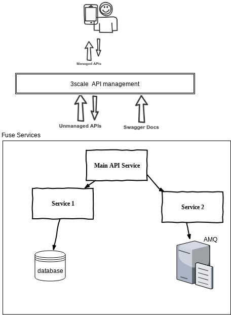

# 3ScaleFuseAMQ

## Demo Story

I'm a developer that's created an integration application consisting of
Multiple services working in combination (let's say single front end with dispatch to two back-ends)
One or more APIs that need to be managed via 3scale
One or more messaging destinations/addresses used for event-driven inputs and outputs
I now want to automate deployment of this application across multiple environments using pre-defined pipelines provided by the platform.  The delivery pipelines must support environment-specific properties, testing, versioning, and the ability to rollback incomplete or failed deployments.

**Products and Projects**

* OpenShift Container Platform
* Red Hat 3scale API Management
* Red Hat Fuse
* MySQl Database
* Red Hat AMQ
* Node JS (RHOAR) Web Application 
* Jenkins CICD

 Steps

* Design a application which integrated with Fuse , AMQ , 3Scale .
* Source to Image (S2i) build and deploy apps on openshift enviroment. 
* Building a pipeline to support automated CI/CD
* Exposing a REST API using Camel, and export API doc to swagger
* Pubslish API on 3scale enviroment using CI/CD pipeline .
* Manage the API through 3scale API management and update the application plan to rate-limit the application.
* Design a web application which invokes the 3scale API gateway .

## Application Environemnt

This demo application contains 4 parts.
 - Gateway application 
    https://github.com/redhatHameed/3ScaleFuseAMQ/tree/master/maingateway-service
    
 - User Service application
    https://github.com/redhatHameed/3ScaleFuseAMQ/tree/master/fisuser-service
    
 - Alert Service Application
    https://github.com/redhatHameed/3ScaleFuseAMQ/tree/master/fisalert-service
    
 - Node Js Web application  
    https://github.com/redhatHameed/3ScaleFuseAMQ/tree/master/nodejsalert-ui

### Setting up Environemnt OpenShift

CI/CD  integration solution

TODO: 
-The below deployment will be achieved using Jenkins Piplines by using CICD approach . 

-Setting up DEV .
-Setting up UAT Environemnt .
-Deploying up web application .
-Setting Up Production Environment .
-Setting up 3scale API Management: (By using Operator or ansible playbooks)

